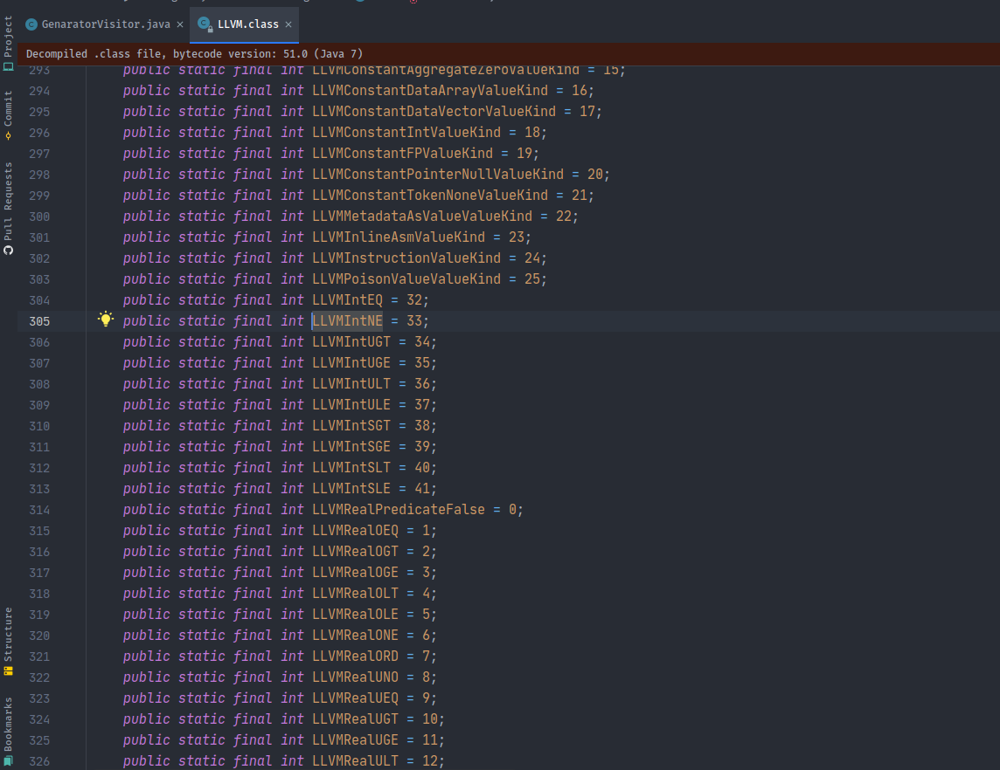

# LLVM JAVA API使用手册

## 准备工作
- 安装LLVM
    - 首先你需要安装LLVM，相关安装方法可查看[环境配置](environments.md)
- 引入javacpp中与LLVM相关的包
```xml
<!--在pom.xml中添加如下依赖-->
    <dependency>
        <groupId>org.bytedeco</groupId>
        <artifactId>llvm-platform</artifactId>
        <version>13.0.1-1.5.7</version>
    </dependency>
```
- import LLVM
``` java
import org.bytedeco.llvm.LLVM.*;
import static org.bytedeco.llvm.global.LLVM.*;
```

## 初始化LLVM
```java 
//初始化LLVM
LLVMInitializeCore(LLVMGetGlobalPassRegistry());
LLVMLinkInMCJIT();
LLVMInitializeNativeAsmPrinter();
LLVMInitializeNativeAsmParser();
LLVMInitializeNativeTarget();  
```

## 创建模块
``` java
    //创建上下文信息
    LLVMContextRef context = LLVMContextCreate();

    //创建module
    LLVMModuleRef module = LLVMModuleCreateWithNameInContext(/*String*/moduleName, context);

    //初始化IRBuilder，后续将使用这个builder去生成LLVM IR
    LLVMBuilderRef builder = LLVMCreateBuilderInContext(context);

    //考虑到我们的语言中仅存在int一个基本类型，可以通过下面的语句为LLVM的int型重命名方便以后使用
    LLVMTypeRef i32Type = LLVMInt32TypeInContext(context);

```

## 创建全局变量

```java
    //创建一个常量,这里是常数0
    LLVMValueRef zero = LLVMConstInt(i32Type, 0, /* signExtend */ 0);

    //创建名为globalVar的全局变量
    LLVMValueRef globalVar = LLVMAddGlobal(module, i32Type, /*globalVarName:String*/"globalVar");

    //为全局变量设置初始化器
    LLVMSetInitializer(globalVar, /* constantVal:LLVMValueRef*/zero);
```

## 生成函数
- 先生成返回值类型
- 多个参数时需先生成函数的参数类型，再生成函数类型
- 用生成的函数类型去生成函数
``` java
    //生成函数参数类型
    PointerPointer<Pointer> argumentTypes = new PointerPointer<>(2)
                .put(0, i32Type)
                .put(1, i32Type);

    //生成返回值类型
    LLVMTypeRef returnType = i32Type;
    
    //生成函数类型
    LLVMTypeRef ft = LLVMFunctionType(returnType, argumentTypes, /* argumentCount */ 2, /* isVariadic */ 0);
    //若仅需一个参数也可以使用如下方式直接生成函数类型
    ft = LLVMFunctionType(returnType, i32Type, /* argumentCount */ 1, /* isVariadic */ 0);

    //生成函数，即向之前创建的module中添加函数
    LLVMValueRef function = LLVMAddFunction(module, /*functionName:String*/"function", ft);
```

## 创建基本块并添加指令
- 基本块即一块只能从头部进入，从尾部退出的代码块
- 基本块的后面跟着终止符指令，内部全部为非终止符指令，这些终止符指令指示在当前块完成后应执行哪个块，最常见的有ret即函数返回，br块跳转，switch多块选择等
- 大多数指令都很容易找到，想具体确定都有哪些可生成的指令可以参考[这里](http://bytedeco.org/javacpp-presets/llvm/apidocs/)->org.bytedeco.llvm.global->LLVM
``` java

    //通过如下语句在函数中加入基本块，一个函数可以加入多个基本块
    LLVMBasicBlockRef block1 = LLVMAppendBasicBlockInContext(context, function, /*blockName:String*/"block1");

    LLVMBasicBlockRef block2 = LLVMAppendBasicBlockInContext(context, function, /*blockName:String*/"block2");

    //选择要在哪个基本块后追加指令
    LLVMPositionBuilderAtEnd(builder, block1);//后续生成的指令将追加在block1的后面

    //获取函数的参数
    LLVMValueRef n = LLVMGetParam(function, /* parameterIndex */0);

    //创建add指令并将结果保存在一个临时变量中
    LLVMValueRef result = LLVMBuildAdd(builder, n, zero, /* varName:String */"result");

    //跳转指令决定跳转到哪个块
    LLVMBuildBr(builder, block2);

    //生成比较指令
    LLVMValueRef condition = LLVMBuildICmp(builder, /*这是个int型常量，表示比较的方式*/LLVMIntEQ, n, zero, "condition = n == 0");
    /* 上面参数中的常量包含如下取值
        LLVMIntEQ,
        LLVMIntNE,
        LLVMIntUGT,
        LLVMIntUGE,
        LLVMIntULT,
        LLVMIntULE,
        LLVMIntSGT,
        LLVMIntSGE,
        LLVMIntSLT,
        LLVMIntSLE,
    */
    //条件跳转指令，选择跳转到哪个块
    LLVMBuildCondBr(builder, 
    /*condition:LLVMValueRef*/ condition, 
    /*ifTrue:LLVMBasicBlockRef*/ ifTrue, 
    /*ifFalse:LLVMBasicBlockRef*/ ifFalse);

    LLVMPositionBuilderAtEnd(builder, block2);//后续生成的指令将追加在block2的后面

    //函数返回指令
    LLVMBuildRet(builder, /*result:LLVMValueRef*/result);
```

- 在基本块中创建并使用局部变量
    - 对于数组变量请使用vector类型
    - 数组变量使用其中的值时需要使用GetElementPtr指令，请自行到[官方文档](http://bytedeco.org/javacpp-presets/llvm/apidocs/)学习如何生成与使用GEP指令

```java 
LLVMPositionBuilderAtEnd(builder, block1);

    //int型变量
    //申请一块能存放int型的内存
    LLVMValueRef pointer = LLVMBuildAlloca(builder, i32Type, /*pointerName:String*/"pointer");

    //将数值存入该内存
    LLVMBuildStore(builder, zero, pointer);

    //从内存中将值取出
    LLVMValueRef value = LLVMBuildLoad(builder, pointer, /*varName:String*/"value");


    //数组变量
    //创建可存放200个int的vector类型
    LLVMTypeRef vectorType = LLVMVectorType(i32Type, 200);

    //申请一个可存放该vector类型的内存
    LLVMValueRef vectorPointer = LLVMBuildAlloca(builder, vectorType, "vectorPointor");
```

## 输出LLVM IR

- 输出到控制台
```java
LLVMDumpModule(module);
```
- 输出到文件
```java
public static final BytePointer error = new BytePointer();
LLVMPrintModuleToFile(module,"test.ll",error);
```

## 关于如何查找java中使用生成LLVM IR的API

这里以翻译`not exp`为例。

main.c文件中程序如下:

```C
int main() {
    int num = 5;
    return !num;
}
```

利用命令`clang -S -emit-llvm main.c -o main.ll -O0`将上面的程序生成到`LLVM IR`，并保存在main.ll文件中，该文件内容如下

```tex
; ModuleID = 'main.c'
source_filename = "main.c"
target datalayout = "e-m:e-p270:32:32-p271:32:32-p272:64:64-i64:64-f80:128-n8:16:32:64-S128"
target triple = "x86_64-pc-linux-gnu"

; Function Attrs: noinline nounwind optnone sspstrong uwtable
define dso_local i32 @main() #0 {
  %1 = alloca i32, align 4
  %2 = alloca i32, align 4
  store i32 0, i32* %1, align 4
  store i32 5, i32* %2, align 4
  %3 = load i32, i32* %2, align 4
  %4 = icmp ne i32 %3, 0
  %5 = xor i1 %4, true
  %6 = zext i1 %5 to i32
  ret i32 %6
}

attributes #0 = { noinline nounwind optnone sspstrong uwtable "frame-pointer"="all" "min-legal-vector-width"="0" "no-trapping-math"="true" "stack-protector-buffer-size"="8" "target-cpu"="x86-64" "target-features"="+cx8,+fxsr,+mmx,+sse,+sse2,+x87" "tune-cpu"="generic" }

!llvm.module.flags = !{!0, !1, !2, !3, !4}
!llvm.ident = !{!5}

!0 = !{i32 1, !"wchar_size", i32 4}
!1 = !{i32 7, !"PIC Level", i32 2}
!2 = !{i32 7, !"PIE Level", i32 2}
!3 = !{i32 7, !"uwtable", i32 1}
!4 = !{i32 7, !"frame-pointer", i32 2}
!5 = !{!"clang version 13.0.1"}
```

我们主要关注函数定义内容，并且忽略`%1 = alloca i32, align 4`与`store i32 0, i32* %1, align 4`。

```
// 对应 int num = 5;
%2 = alloca i32, align 4
store i32 5, i32* %2, align 4
// 对应 return !num;
%3 = load i32, i32* %2, align 4
%4 = icmp ne i32 %3, 0
%5 = xor i1 %4, true
%6 = zext i1 %5 to i32
ret i32 %6
```

可以看到，在翻译`return !num;`时，首先取出`num`的值到`%3`中，然后比较`%3`的值与`0`是否不相等（注意返回值`%4`不是`int32`类型，而是`int1`类型），接着用`%4`与`true`做异或得到`%5`，然后将`int1`类型的`%5`扩展为`int32`类型，最后返回。

上面的翻译过程在助教的代码中表现为：

```
// 生成icmp
tmp_ = LLVMBuildICmp(builder, LLVMIntNE, LLVMConstInt(i32Type, 0, 0), tmp_, "tmp_");
// 生成xor
tmp_ = LLVMBuildXor(builder, tmp_, LLVMConstInt(LLVMInt1Type(), 1, 0), "tmp_");
// 生成zext
tmp_ = LLVMBuildZExt(builder, tmp_, i32Type, "tmp_");
```

下面我就上面的程序翻译提出三个问题并给出解答：

+ 1、我从来没接触过`LLVM IR`，怎么知道如何翻译`not exp`呢？
  + 按照我们的演示过程，你可以自己手动写一个测试文件，并且生成`LLVM IR`的格式。对着它，你就知道可以选择`LLVMBuildICmp`、`LLVMBuildXor`、`LLVMBuildZExt`这三个方法来生成对应的指令了。
  
+ 2、我如何知道上面三个方法的参数的含义呢？
  + 浏览器搜索。这里提供两个网址`https://thedan64.github.io/inkwell///llvm_sys/core/fn.LLVMBuildZExt.html`、`http://bytedeco.org/javacpp-presets/llvm/apidocs/org/bytedeco/llvm/global/LLVM.html`，可以搜索对应的函数，并通过参数名推测各参数的含义。
  
+ 3、对于`LLVMBuildICmp`方法，我根本不知道它的第二个参数该怎么办设置咋办？上面的网址搜出来的只有这个`LLVMBuildICmp(LLVMBuilderRef arg0, int Op, LLVMValueRef LHS, LLVMValueRef RHS, BytePointer Name)`，第二个参数应该是个常量，但怎么知道该设置成什么呢？
  
  + 借助github。
  
    + 首先搜索`LLVMBuildICmp`。得到结果为：
  
    + 点击Code，然后选择Java，
  
      现在你可以看到`LLVMIntSLE`，`LLVMIntEQ`等出现在了第二个参数的位置上，你可以选择clone这些项目，然后查看`LLVMIntSLE`，`LLVMIntEQ`是在哪里定义的，助教本地的结果如下
  
      在这里面你可以看到各种各样的常量，依据参数名你应该可以找到你需要的那一个。如果光看名字认不出来，你还可以选择复制变量名，浏览器搜索，常用的都可以搜索到结果。

## 写在最后

现在你已经学会了如何使用LLVM API生成LLVM IR，快去试试写代码吧